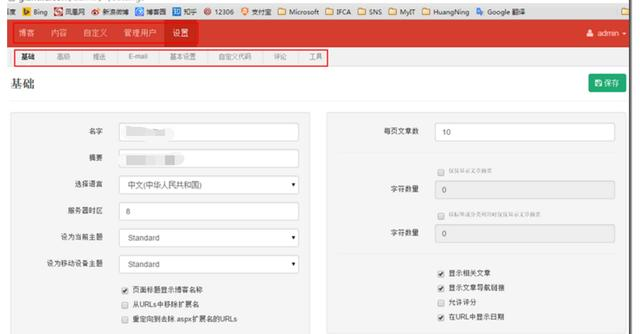
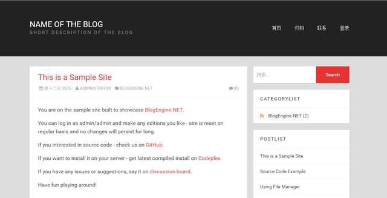

# 如何搭建个人博客

> 原文链接：<http://www.6ke.com.cn/seoxuetang/2019/0714/7104.html> 

有个个人博客网站，不论是从个人知识积累还是程序员逼格上都是很一件很不错的事，那面建个人网站需要哪些步骤呢？

1. 申请域名

   有了域名，你才可以绑定你的网站，通过域名去访问你的网站，申请域名的地方很多，百度一下随便找家就行，比如万网，腾讯云上都可以申请。

2. 购买云服务器

   有了服务器你才可以部署你的网站，别人才可以正常访问，目前国内比较知名的当然是阿里云、腾讯云和百度云，现在也刚出来京东云。阿里云、腾讯云和京东云都有学生优惠，一个月就几块钱还挺不错。目前，京东云才出来，优惠比较多，可以获得几百的优惠券，是个很不错的选择。

3. 搭建个人博客

   选择一个好的开源博客搭建安装就行，可以到开源中国上面去找，有很多比较好的开源博客系统，比如BlogEngine.net是一个.net开源博客，它很容易在windows上搭建起来，我们在网上找到它的开源包，配置下web.config,将数据库改为sql server。

4. ```
   <add storageVariable="BlogEngine" description="Sql Database Provider" name="DbBlogProvider" type="BlogEngine.Core.Providers.DbFileSystemProvider, BlogEngine.Core" />
   ```

   当然，如果你没有安装数据库，你可以使用xml的方式保存。改为sql server后配置下数据库的登录名和密码

5. ```
   <add name="BlogEngine" connectionString="Data Source=XXXXXXXXXXXX;User ID=user;Password=password;persist security info=False;initial catalog=databaseName;" providerName="System.Data.SqlClient"/>
   ```

   配置好后，通过IIS（如果没安装，则在windows组件中添加安装就ok）新建网站，指定域名和我们安装包地址，启动网站，我们就可以在浏览器里输入http://域名/admin则进行初始化配置、安装，界面如下：

   

这样我们的个人博客就搭建好了，博客的界面如下:

