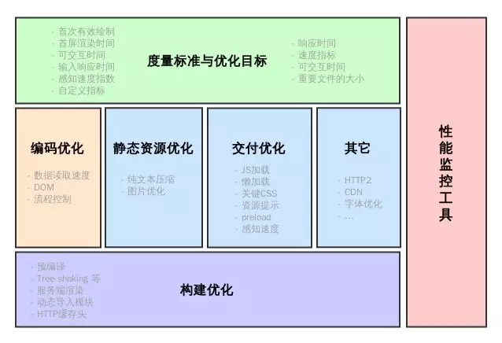

## 嗨，送你一张Web性能优化地图

> 原文链接:  https://mp.weixin.qq.com/s?__biz=MzUxMTcwOTM4Mg==&mid=2247483962&idx=1&sn=f9337ad983c6303811eb43d07d9f23d5&chksm=f96edb93ce195285943211e645cc683989826abdaaa8ab0b073a20761369ed04843c835c50b7#rd 
>
> 本文作者是来自360导航的前端开发工程师 Berwin，W3C 性能工作组成员，同时也是《深入浅出Vue.js》（待出版）的作者。

我们都知道对于Web应用来说性能很重要。然而性能优化相关的知识却非常的庞大并且杂乱。对于性能优化需要做些什么以及性能瓶颈是什么，通常我们并不清楚（*不包括那些对性能优化有丰富经验的高手）。*

事实上关于Web性能有很多可以优化的点，其中涉及到的知识大致可以划分为几类：**度量标准**、**编码优化**、**静态资源优化**、**交付优化**、**构建优化**、**性能监控**。


本文主要介绍性能优化需要做的事以及需要考虑的问题。目的在于给读者脑海中生成一个宏观的地图。

不会介绍每个优化项目具体如何操作。PS：后续会有系列文章针对不同优化分类下的具体优化操作进行更详细的介绍。

1

**度量标准与设定目标**

在进行性能优化之前，我们需要为应用选择一个正确的度量标准（性能指标）以及设定一个合理的优化目标。

> 并不是所有指标都同样重要，这取决于你的应用。最后根据度量标准设定一个现实的目标。

**1.1 度量标准**

下面是一些值得考虑的指标：

- 首次有效绘制（First Meaningful Paint，简称FMP，当主要内容呈现在页面上）
- 英雄渲染时间（Hero Rendering Times，度量用户体验的新指标，当用户最关心的内容渲染完成）
- 可交互时间（Time to Interactive，简称TTI，指页面布局已经稳定，关键的页面字体是可见的，并且主进程可用于处理用户输入，基本上用户可以点击UI并与其交互）
- 输入响应（Input responsiveness，界面响应用户输入所需的时间）
- 感知速度指数（Perceptual Speed Index，简称PSI，测量页面在加载过程中视觉上的变化速度，分数越低越好）
- 自定义指标，由业务需求和用户体验来决定。

FMP与英雄渲染时间非常相似，但它们不一样的地方在于FMP不区分内容是否有用，不区分渲染出的内容是否是用户关心的。

**1.2 设定目标**

- 100毫秒的界面响应时间与60FPS
- 速度指标（Speed Index）小于1250ms
- 3G网络环境下可交互时间小于5s
- 重要文件的大小预算小于170kb

以上四种指标的设定都**有据可循**。详细信息请查看RAIL性能模型。

2 **编码优化**

编码优化涉及到应用的运行时性能，本小节介绍几个可以提升程序运行时性能的建议。

**2.1 数据读取速度**

事实上数据访问速度有快慢之分，下面列出几个影响数据访问速度的因素：

- 字面量与局部变量的访问速度最快，数组元素和对象成员相对较慢
- 变量从局部作用域到全局作用域的搜索过程越长速度越慢
- 对象嵌套的越深，读取速度就越慢
- 对象在原型链中存在的位置越深，找到它的速度就越慢

> 推荐的做法是缓存对象成员值。将对象成员值缓存到局部变量中会加快访问速度

**2.2 DOM**

应用在运行时，性能的瓶颈主要在于DOM操作的代价非常昂贵，下面列出一些关于DOM操作相关提升性能的建议：

- 在JS中对DOM进行访问的代价非常高。请尽可能减少访问DOM的次数（建议缓存DOM属性和元素、把DOM集合的长度缓存到变量中并在迭代中使用。读变量比读DOM的速度要快很多。）
- 重排与重绘的代价非常昂贵。如果操作需要进行多次重排与重绘，建议先让元素脱离文档流，处理完毕后再让元素回归文档流，这样浏览器只会进行两次重排与重绘（脱离时和回归时）。
- 善于使用事件委托

**2.3 流程控制**

下面列出一些流程控制相关的一些可以略微提升性能的细节，这些细节在大型开源项目中大量运用（例如Vue）：

- 避免使用for...in（它能枚举到原型，所以很慢）
- 在JS中倒序循环会略微提升性能
- 减少迭代的次数
- 基于循环的迭代比基于函数的迭代快8倍
- 用Map表代替大量的if-else和switch会提升性能

3 **静态资源优化**

Web应用的运行离不开静态资源，所以对静态资源的优化至关重要。

**3.1 使用Brotli或Zopfli进行纯文本压缩**

在最高级别的压缩下Brotli会非常慢（但较慢的压缩最终会得到更高的压缩率）以至于服务器在等待动态资源压缩的时间会抵消掉高压缩率带来的好处，但它非常适合静态文件压缩，因为它的解压速度很快。

使用Zopfli压缩可以比Zlib的最大压缩提升3％至8％。

**3.2 图片优化**

尽可能通过srcset，sizes和<picture>元素使用**响应式图片**。还可以通过<picture>元素使用WebP格式的图像。

响应式图片可能大家未必听说过，但响应式布局大家肯定都听说过。响应式图片与响应式布局类似，它可以在不同屏幕尺寸与分辨率的设备上都能良好工作（比如自动切换图片大小、自动裁切图片等）。

当然，如果您不满足这种尺度的优化，还可以对图片进行更深层次的优化。例如：模糊图片中不重要的部分以减小文件大小、使用自动播放与循环的HTML5视频替换GIF图，因为视频比GIF文件还小（好消息是未来可以通过img标签加载视频）。

4 **交付优化**

交付优化指的是对页面加载资源以及用户与网页之间的交付过程进行优化。

**4.1 异步无阻塞加载JS**

JS的加载与执行会阻塞页面渲染，可以将Script标签放到页面的最底部。但是更好的做法是异步无阻塞加载JS。有多种无阻塞加载JS的方法：defer、async、动态创建script标签、使用XHR异步请求JS代码并注入到页面。

但更推荐的做法是使用defer或async。如果使用defer或async请将Script标签放到head标签中，以便让浏览器更早地发现资源并在后台线程中解析并开始加载JS。

**4.2 使用Intersection Observer实现懒加载**

懒加载是一个比较常用的性能优化手段，下面列出了一些常用的做法：

- 可以通过Intersection Observer延迟加载图片、视频、广告脚本、或任何其他资源。
- 可以先加载低质量或模糊的图片，当图片加载完毕后再使用完整版图片替换它。

> 延迟加载所有体积较大的组件、字体、JS、视频或Iframe是一个好主意

**4.3 优先加载关键的CSS**

CSS资源的加载对浏览器渲染的影响很大，默认情况下浏览器只有在完成<head>标签中CSS的加载与解析之后才会渲染页面。如果CSS文件过大，用户就需要等待很长的时间才能看到渲染结果。针对这种情况可以将首屏渲染必须用到的CSS提取出来内嵌到<head>中，然后再将剩余部分的CSS用异步的方式加载。可以通过Critical做到这一点。

**4.4资源提示（Resource Hints）**

Resource Hints（资源提示）定义了HTML中的Link元素与dns-prefetch、preconnect、prefetch与prerender之间的关系。它可以帮助浏览器决定应该连接到哪些源，以及应该获取与预处理哪些资源来提升页面性能。

#### 4.4.1 dns-prefetch

dns-prefetch可以指定一个用于获取资源所需的源（origin），并提示浏览器应该尽可能早的解析。

> ```
> <link rel="dns-prefetch" href="//example.com">
> ```

#### 4.4.2 preconnect

preconnect用于启动预链接，其中包含DNS查找，TCP握手，以及可选的TLS协议，允许浏览器减少潜在的建立连接的开销。

> ```
> <link rel="preconnect" href="//example.com"><link rel="preconnect" href="//cdn.example.com" crossorigin>
> ```

#### 4.4.3 prefetch

Prefetch用于标识下一个导航可能需要的资源。浏览器会获取该资源，一旦将来请求该资源，浏览器可以提供更快的响应。

> ```
> <link rel="prefetch" href="//example.com/next-page.html" as="html" crossorigin="use-credentials"><link rel="prefetch" href="/library.js" as="script">
> ```

> 浏览器不会预处理、不会自动执行、不会将其应用于当前上下文。

as与crossorigin选项都是可选的。

#### 4.4.4 prerender

prerender用于标识下一个导航可能需要的资源。浏览器会获取并执行，一旦将来请求该资源，浏览器可以提供更快的响应。

> ```
> <link rel="prerender" href="//example.com/next-page.html">
> ```

浏览器将预加载目标页面相关的资源并执行来预处理HTML响应。

**4.5 Preload**

通过一个现有元素（例如：img，script，link）声明资源会将获取与执行耦合在一起。然而应用可能只是想要先获取资源，当满足某些条件时再执行资源。

Preload提供了预获取资源的能力，可以将获取资源的行为从资源执行中分离出来。因此，Preload可以构建自定义的资源加载与执行。

例如，应用可以使用Preload进行CSS资源的预加载、并且同时具备：高优先级、不阻塞渲染等特性。然后应用程序在合适的时间使用CSS资源：

> ```
> <!-- 通过声明性标记预加载 CSS 资源 --><link rel="preload" href="/styles/other.css" as="style"><!-- 或，通过JavaScript预加载 CSS 资源 --><script>var res = document.createElement("link");res.rel = "preload";res.as = "style";res.href = "styles/other.css";document.head.appendChild(res);</script>
> ```

> ```
> <!-- 使用HTTP头预加载 -->Link: <https://example.com/other/styles.css>; rel=preload; as=style
> ```

**4.6 快速响应的用户界面**

PSI（Perceptual Speed Index，感知速度指数）是提升用户体验的重要指标，让用户感觉到页面的反馈比没有反馈体验要好很多。

可以尝试使用骨架屏或添加一些Loading过渡动画提示用户体验。

输入响应（Input responsiveness）指标同样重要，甚至更重要。试想，用户点击了网页后缺毫无反应会是什么心情。JS的单线程大家已经不能再熟悉，这意味着当JS在运行时用户界面处于“锁定”状态，所以JS同步执行的时间越长，用户等待响应的时间也就越长。

据调查，JS执行100毫秒以上用户就会明显觉得网页变卡了。所以要严格限制每个JS任务执行时间不能超过100毫秒。

解决方案是可以将一个大任务拆分成多个小任务分布在不同的Macrotask中执行（通俗的说是将大的JS任务拆分成多个小任务异步执行）。或者使用WebWorkers，它可以在UI线程外执行JS代码运算，不会阻塞UI线程，所以不会影响用户体验。

> 应用越复杂，主动管理UI线程就越重要

5 **构建优化**

现代前端应用都需要有构建的过程，项目在构建过程中是否进行了合理的优化，会对Web应用的性能有着巨大的影响。例如：影响构建后文件的体积、代码执行效率、文件加载时间、首次有效绘制指标等。

**5.1 使用预编译**

拿Vue举例，如果您使用单文件组件开发项目，组件会在编译阶段将模板编译为渲染函数。最终代码被执行时可以直接执行渲染函数进行渲染。而如果您没有使用单文件组件预编译代码，而是在网页中引入vue.min.js，那么应用在运行时需要先将模板编译成渲染函数，然后再执行渲染函数进行渲染。相比预编译，多了模板编译的步骤，所以会浪费很多性能。

**5.2 使用 Tree-shaking、Scope hoisting、Code-splitting**

Tree-shaking是一种在构建过程中清除无用代码的技术。使用Tree-shaking可以减少构建后文件的体积。

目前Webpack与Rollup都支持Scope Hoisting。它们可以检查import链，并尽可能的将散乱的模块放到一个函数中，前提是不能造成代码冗余。所以只有被引用了一次的模块才会被合并。使用Scope Hoisting可以让代码体积更小并且可以降低代码在运行时的内存开销，同时它的运行速度更快。前面2.1节介绍了变量从局部作用域到全局作用域的搜索过程越长执行速度越慢，Scope Hoisting可以减少搜索时间。

code-splitting是Webpack中最引人注目的特性之一。此特性能够把代码分离到不同的bundle中，然后可以按需加载或并行加载这些文件。code-splitting可以用于获取更小的bundle，以及控制资源加载优先级，如果使用合理，会极大影响加载时间。

**5.3 服务端渲染（SSR）**

单页应用需要等JS加载完毕后在前端渲染页面，也就是说在JS加载完毕并开始执行渲染操作前的这段时间里浏览器会产生白屏。

服务端渲染（Server Side Render，简称SSR）的意义在于弥补主要内容在前端渲染的成本，减少白屏时间，提升首次有效绘制的速度。可以使用服务端渲染来获得更快的首次有效绘制。

比较推荐的做法是：使用服务端渲染静态HTML来获得更快的首次有效绘制，一旦JavaScript加载完毕再将页面接管下来。

**5.4 使用import函数动态导入模块**

使用import函数可以在运行时动态地加载ES2015模块，从而实现按需加载的需求。

这种优化在单页应用中变得尤为重要，在切换路由的时候动态导入当前路由所需的模块，会避免加载冗余的模块（试想如果在首次加载页面时一次性把整个站点所需要的所有模块都同时加载下来会加载多少非必须的JS，应该尽可能的让加载的JS更小，只在首屏加载需要的JS）。

> 使用静态import导入初始依赖模块。其他情况下使用动态import按需加载依赖

**5.5 使用HTTP缓存头**

正确设置expires，cache-control和其他HTTP缓存头。

推荐使用Cache-control: immutable避免重新验证。

6 **其他**

其他一些值得考虑的优化点：

- HTTP2
- 使用最高级的CDN（付费的比免费的强的多）
- 优化字体
- 其他垂直领域的性能优化

7 **性能监控**

最后，你可能需要一个性能检测工具来持续监视网站的性能。

8 **总结**

最后用一张图来总结这篇文章所表达的内容，感谢@anjia帮忙画的这张图。



> 