[TOC]

# ipad 常用软件

**初步建议：**

PDF: margin note  相对于手写笔记应用，MarginNote 更侧重于阅读学习，记的功能被弱化了，而加入了类似思维导图的功能，用它来阅读书籍和文档最合适不过了。 

 或 PDF expert 对于专业需求的PDF批注支持很好。 

笔记： Goodnotes 或 notability 

#### 1. PDF

-  **Flexcil：**PDF阅读软件，有强大的标注功能，搭配欧路词典分屏使用学英语有奇效。 

- PDF Expert： http://baijiahao.baidu.com/s?id=1605594724461310600&wfr=spider&for=pc 

-  我一直有一个疑问，看pdf，而且标注做笔记的话，pdf expert，goodnote，notability都可以打开。

  但是貌似后两者侧重于做笔记，就像在白纸上一样。

  但是阅读体验，pdf expert更好，全屏，就跟翻书一样 

-  试过十几个pdf阅读器，最后选了pdf expert。还有documents，可以管理、阅读各种格式的文件，类似windows的资源管理器，我在里面放了60多G的pdf，epub，mp3 

- GoodReader 可以非常完整、流畅地显示 PDF 文档以及使用 Adobe PDF Reader 做的所有标记。Adobe 在 iOS 上有自己的免费软件，但是稳定性很差，稍微大一点（几十页）并带标记的文档，在那上面经常崩溃。

  GoodReader 支持通用的 PDF 文档标记以及手写标记，可以和各种云存储服务无缝链接，支持标签式和全屏浏览，功能强大稳定，无愧于 Mashable 网站给它的评价「A Swiss Army knife of awesome」。GoodReader 还能用来看漫画，更多的一些功能参见 [GoodReader 的网站](https://www.goodreader.com/)，这里就不赘述了。 https://sspai.com/post/35271 

- 接着推荐一款很有趣的 App，叫 [LiquidText](https://sspai.com/tag/LiquidText)。这是一个免费软件，其中有一些功能（如标签式浏览）需要内购。我付费了，不过感觉好像用处不大，它的两个最核心的功能都是免费的。

  LiquidText 第一个重要功能是可以组织文档里的标记内容。LiquidText 把整个阅读视图分成了两栏，一栏显示文档，而另一栏显示标记。在文档栏里，你可以轻松地高亮一段文字、一张图片等，然后拖动到标记栏。

  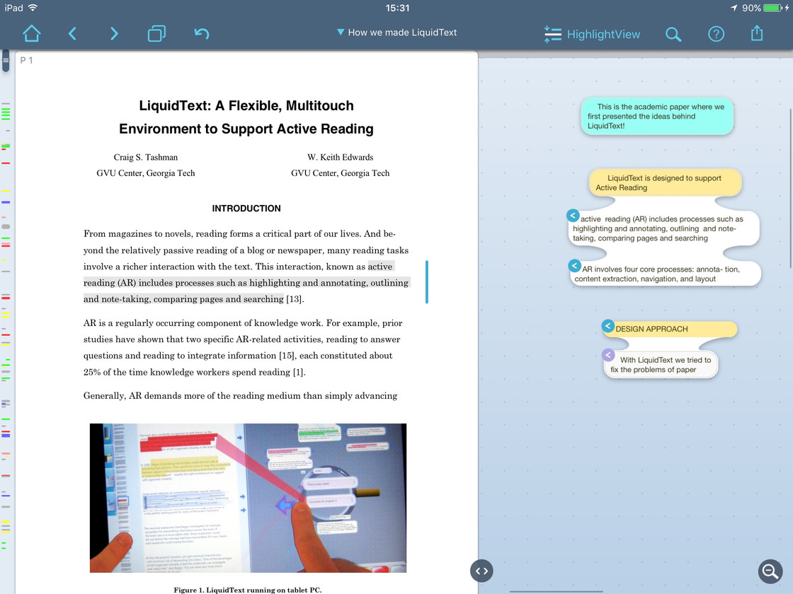

  在标记栏里，你可以对标记内容做整理工作。这包括：

  \1. 点击一个标记，可以快速定位到那个标记在文档中的位置。

  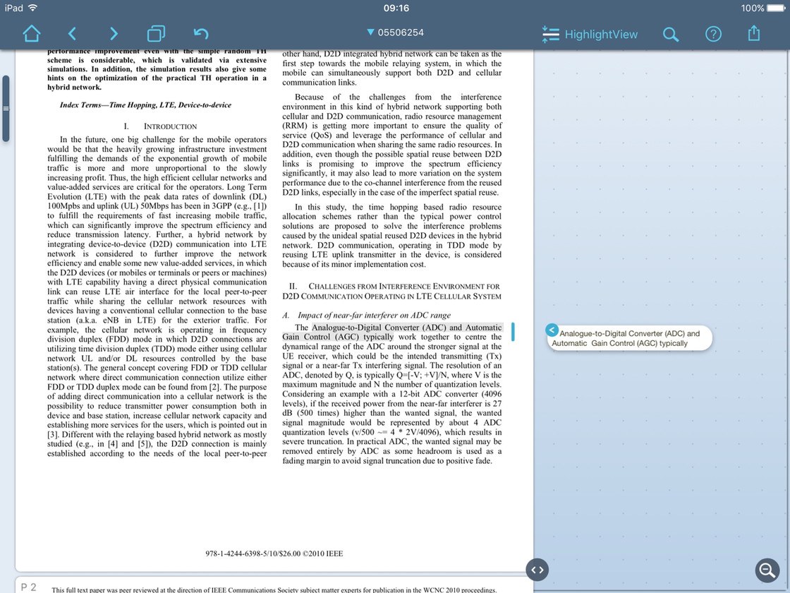

  \2. 插入一个 textbox，在里面输入笔记。

  \3. 拖动标记，可以把多个标记组成一个 group。这个功能非常有用，我标记的文档内容，一般是文档的重点。把相关的标记组成 groups，再在每个 group 加一个自己的理解，这样通过看这些标记，就可以把整个文档的脉络（讲了几个内容，之间的逻辑关系是什么）、精华部分一眼就看清楚。

  

  \4. 把标记输出成 PDF 或者 Word 文档。在输出的时候，我会勾选 include your LiquidText Workspace 这个选项。这个选项会把标记栏的内容添加到原文档里。添加格式可以在 Option 中选择，大家可以试试不同的输出格式，这里不做赘述。这样输出的文档，既包括你在标记栏里的标记，也会高亮原文档相应部分，非常适合自己阅读或是分享给他人阅读。

  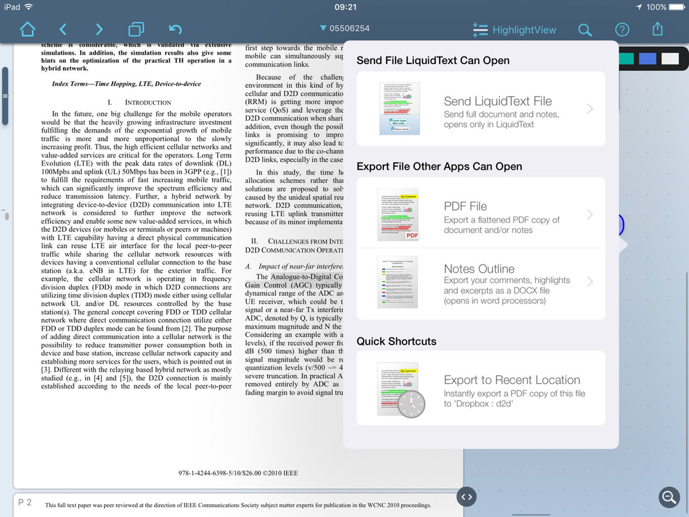

  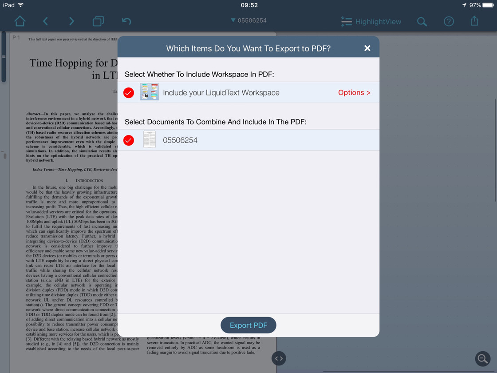

  LiquidText 第二个重要的功能是「折叠」文档。

  一直以来，我觉得阅读电子文档有一个很大的问题，就是跳页非常困难。比如我在看第 100 页的时候，突然想起第 20 页有个段落似乎和目前读的有联系，想翻回去看看，两者做一个对比。这个常见的阅读场景，由于要在两个不同的阅读位置来回切换，在电子阅读的时候，总显得非常不顺畅，极大地影响了阅读体验。

  LiquidText 用「折叠」文档的方式，优雅地缓解了这个问题。在 LiquidText 里，你可以用一个手指 pin 住你现在的阅读位置，另个手指拨动文档的时候，文档会不断被「折叠」，于是你就可以同时阅读到两个地方的文字了。

  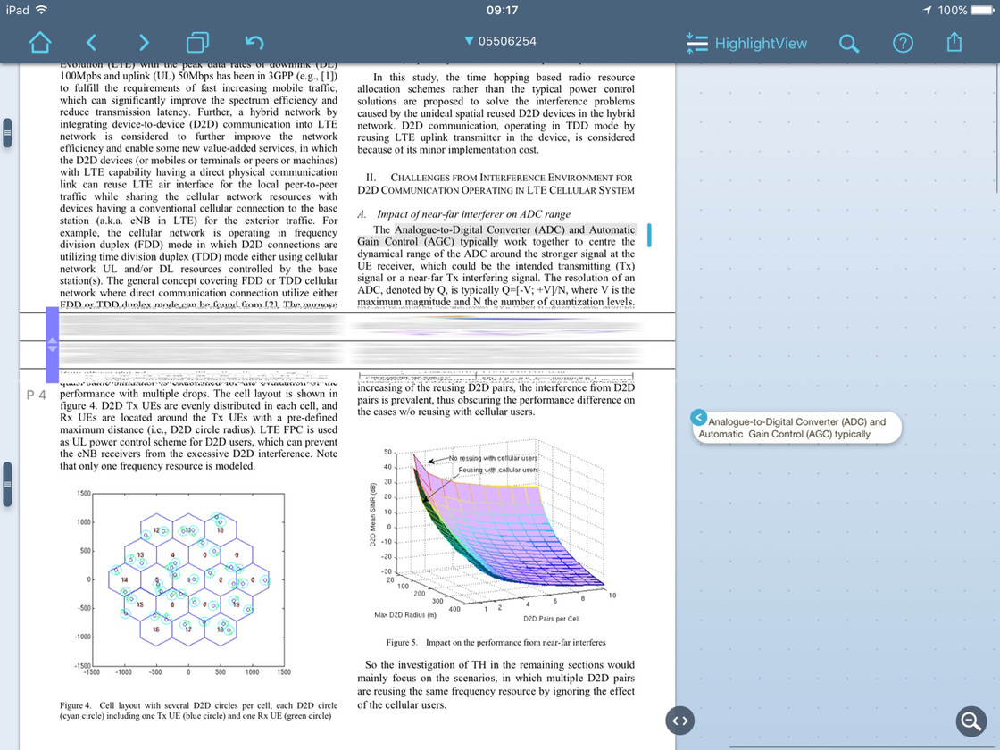

  这个功能还可以配合搜索使用。你搜索文档后，可以通过「折叠」文档的方式，把所有带关键字的段落凸显出来，而别的段落会被「折叠」起来。

  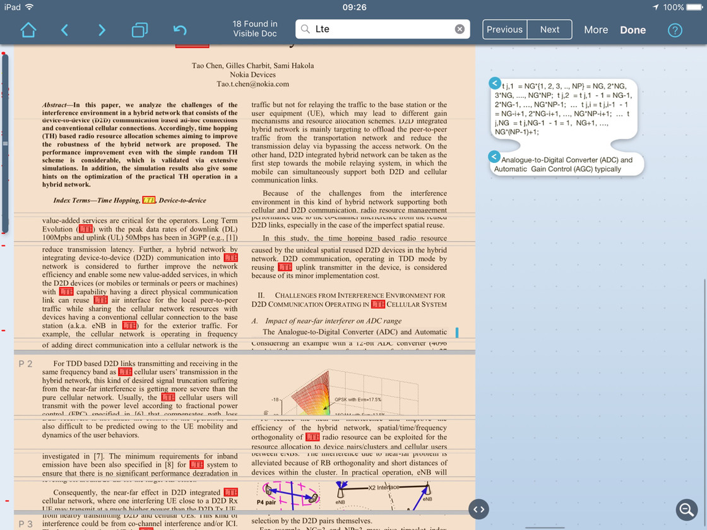

  LiquidText 的这两个功能，我觉得在我阅读文档，尤其是技术类文档和科研文献的时候，极大地提高了阅读体验和效率，非常靠谱。大家有兴趣可以上 [LiquidText 的网站](http://liquidtext.net/) 看看操作视频。

  

#### 2. 笔记\

网红软件应该当属**notability**和**Goodnotes**，也是我用的最多的两个，其他软件里**notes plus**个人觉得手写最好看，**UPAD**比较适合习惯电子手帐的妹子，但是功能都不如前两个全，所以这里主要介绍前两种。

 比较重要的一点，Goodnotes的搜索功能很强，可以识别手写的笔记。

Goodnotes 并没有录音功能，**notability**具有录音功能，可以将开会等录音导入， 对于录音功能，我还比较欣赏的一个细节是**录音分段进行**，如果有什么特殊情况导致录音中断或忘记录音，也不会导致这段报告之前的录音丢失。

Goodnotes 可以进行封面设计

 GoodNotes最强大的功能是支持pdf里文字识别（就是抓词～），对学习英语内容的pdf来说超实用，这个功能Notability里是木有哒！ 

 Margin note 不夸张的说这个真的是我用过的所有阅读app中最方便的！ 

 Notability：优点是可以录音，上课的时候开启这个功能简直开挂哈哈～（虽然我好像一次都没用过）对于颜控，Notability笔的颜色、粗细选择更多，而且配合apple pencil似乎流畅性更好写出来的字更好看（可以比较一下图5和图3）Notability的纵向翻页也能更好的用到页边的位置，在复习时也可以连贯阅读，图5截的就是两页的衔接处，过渡比Goodnotes自然很多。但缺点是误触率比Goodnotes高，且无法搜索手写内容。  

- 将记笔记交给最专业的软件。

  

  它作为一款网红级笔记功能APP，功能自然非常强大，在课堂上可以直接录音，回家以后可以针对知识点重新听课，加强记忆。

  如果老师没有事先把课件放出来的话，Notability可以先空出插入课件的地方，等上完课找老师要到了PPT，再行插入。

  而如果老师提前放出课件，那就可以直接导入。

  在课件上记录，这样一学期下来，再也不会几个厚厚的[文件夹](https://www.smzdm.com/fenlei/wenjianjia/)用来备查了，只需要把iPad打开，就可以完成笔记的复习。

  除此以外，使用Kindle看书时，用它做笔记最合适不过了。

  而且，APP组合起来用的功效超乎大家的想象。

  利用Kindle APP（或者MarginNote）阅读电子书，使用Notability作笔记，分屏同时使用特别高效。

- **MarginNote ** 脑图，知识卡片功能强大，更多的是作为阅读PDF做笔记的软件

   尤其是在一段时间内放弃学习后，常常无法跟上之前的内容而只好从头开始，造成了时间的极度浪费。 MarginNote 通过自动生成批注卡片来帮助记忆，不需要将文本从头看起，只需要养成将重点做标记，在疑难处做批注的习惯，就可以高效回忆书本的重点。当然，这不是我们使用MarginNote的正常流程。在坚持阅读学习的情况下，每章节做的标记最后会汇总到学习区。由于学习模式下， MarginNote 支持多书籍进入同一笔记本，这样几本书的相关知识点可以有效集合和补充，成为一套完整的系统。 

   对我来说，自学不同于课堂学习，它需要的是有效而长期的理解和记忆力，借助它的卡片复习功能，我能够在独立于教师的情况下引导自己学习和记忆，支持我的长期自学。**书应该先读薄再读厚，读薄在于能用自己的语言概述大意掌握核心思路，读厚在于依赖文本的理解和批注。**无论是纸质书还是电子书，这两种习惯都应该保持下来，才好扩充个人知识库。 

  

  这是一款笔记功能十分强大的阅读软件，强大到什么程度呢，看该软件给出的指导说明就知道了。

  不仅可以做五颜六色粗细形状不一的笔记，也可以添加评论，最重要的是还可以导出大纲和思维导图，甚至是保存成适合电脑查看的pdf或word，非常面面俱到了。

  个人认为MarginNote很适合资料很多的工作党和文献如山的学生党，需要快速浏览的可以标注出重点加上一两句评语，需要精读的也逐字逐句地分析，并导出笔记供后续参考。

-  **one note：**微软出品的笔记类app，使用onedrive(微软云)同步，在iOS上略有不足。日常拿来当草稿本涂涂写写记录灵感，因为书写纸非常非常大！！！免费 

- **Notability：**  集写读为一体的软件

- Evernote

- 有道云笔记

-  笔记 App 方面，相较于很多人推荐的 [Evernote](https://sspai.com/tag/Evernote) 和 [Onenote](https://sspai.com/tag/Microsoft OneNote)，我觉得 [Workflowy](https://workflowy.com/) 才真正是做笔记、摘抄的神器，比 Evernote、Onenote 好用多了。我会在另外一篇博客里详细介绍 Workflowy 的各种用处。 [来源]( https://sspai.com/post/35271 )

- 4.marginnote

  

  notability主界面

  notability是我最常用的记笔记app，也可以在里面插入pdf书籍，直接在书上做笔记，还可以随意任何地方贴上便签和加页面，好方便！

  

  notability笔记

  这是我的其中一个笔记页面，随意插图，而且还可以插gif格式的图片，在理解svm的时候做笔记，左下角的图片就是动图，炫酷

  

- goodnotes

goodnotes和notability功能差不多，但是goodnotes是横屏翻页，notability是竖屏下翻，看个人喜欢什么方式了~

两个app都是可以自己新建笔记本，goodnotes还可以自己选择笔记本的封面

goodnotes主界面

- marginnote

  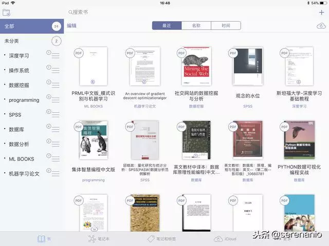

  ​																		marginnote主界面

  比较适合看书看论文做笔记，可以直接找到自己做笔记的位置，还可以将所有笔记生成思维导图的形式

  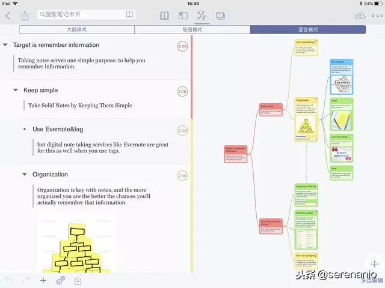

  ​																marginnote笔记思维导图

- 接下来就是绘画常用的procreate了！

  

  基本的功能全都有，画笔也十分丰富，新出了一些功能，大家可以继续探索一下，而且procreate还支持将你的绘画过程录成视频的功能噢

  

  其实如果是个大触的话，画成下面这个样子也是没问题的....

  

  官方案例

  emmm...不过这些app加起来在app store的售价都超过两百了...

  如果想要免费下载全部app（价值8408rmb）可以在微信小程序的微店搜索sourceuniverse找到我噢https://www.jianshu.com/p/a948f73077ba来源：简书著作权归作者所有。商业转载请联系作者获得授权，非商业转载请注明出处。

- upad3

  笔记模板很多，在最下端拉开挡板功能，进行放大后就像是在真纸上书写一样。

#### 3. 代码编辑

- 看了一些经验，貌似都是需要将工程进行压缩成zip才可以以文件夹的形式打开

-  8ujTextStatic  不错

-  GOCOEDIT 

   带树形显示文件夹 ，但不支持github

- CodeNavigatorLite

- 

  我来为大家提供一套详细的解决方案！上下班路上时间长想节约时间看看代码的程序猿们看过来。

  这两个应用结合起来用，百度云比较已经比较成熟，上传同步下载的操作都很方便。而Code Viewer比较干净，没有多余的复杂功能，清清爽爽的读代码。接下来把代码资源打包，记得打包成zip。

  

  然后打开web版或pc版百度云，将zip上传。
  分分钟上传成功，而且因为打包好了，没有零碎的文件，直接转移到ipad上打开百度云找到文件下载。

  

  百度云提供解压缩功能，但这里我们不需要解压，点击下方的打开方式按钮，选择打开方式。
  然后稍等片刻，应用自动跳转到Code Viewer中，代码已经准备好了。

  

  初始的字体比较小，默认风格可能你也觉得不够极客，没关系，退回到最外层目录，点击设置按钮，轻松设置。

  

  我用的免费版的，所以默认有两个风格可选，其他酷炫的style需要完全版。不过一般来说也够用了。看看效果：

  

  整个工程一气呵成的导入了，而且关键字自动配色，可以轻松愉快的review代码啦。

- 

  想通过doxygen产出pdf文档，结果latex怎么也生成不了pdf，各种出错，折腾半天也没搞定。

  最近通过以下方法可以实现code navigator：

  1.工具：

  - doxygen（pc、mac、linux，生成html跳转文档）
  - documents by Readdle（ipad，可以浏览html文件）

  2.步骤：

  - 用doxygen生成html文档，注意要配置输出源代码（SOURCE_BROWSER）；
  - 配合doxygen，如果想生成调用图和类图、UML等，需要安装graphviz，并配置dot执行路径
  - 将生成的html通过itunes拷贝到documents的目录中(ipad上），然后可以在documents上开始浏览和学习；当然也可以通过icloud、google drive等云盘来存储，有待后续研究documents的用法。

  献上一张图：

  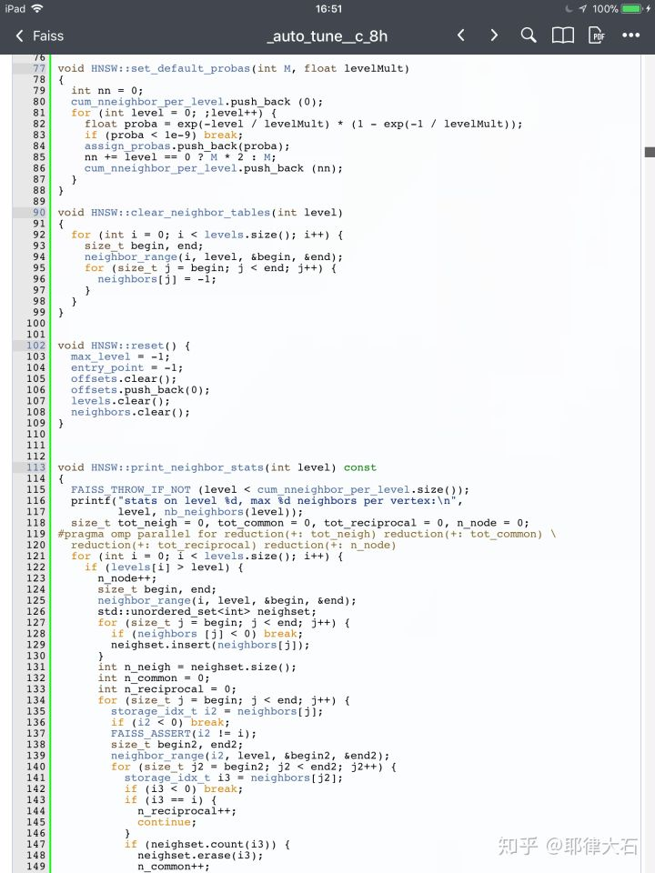

  但是有个缺点，不能浮标显示，只能跳转

#### 4. 思维导图

-  **lighten：**Xmind出品的思维导图软件，洁面极简，功能强大，不仅有多款导图主题，还可以支持导出6种文件类型。

-  **XMind - 思维导图软件** 

#### 5. 英语

- 欧路词典

   欧路词典单独使用时一款比较普通的查词软件 

  但在ipad上和goodnotes结合起来使用，会发现节省了不少时间。

  利用分屏功能，同事打开欧路词典和goodnotes。

  当你在goodnotes上点一个词的时候，不需要再复制粘贴到欧路词典，欧路词典会自动帮你搜索词义。

- **Anyway**  

- 墨墨背单词，用记忆曲线的方法规划每天的复习量，单词量也可以改。

- 每日英语听力

- 有道词典

#### 6. 写作，草稿

- 我还时常需要做草稿。我主要要做三种不同的草稿：

  - 做科研经常需要演算、画图；
  - 带领团队做项目或是创业，为团队制定目标和时间点的草稿；
  - 文字草稿。

  这三种草稿需求其实都是用纸和笔实现比较好。当然第二种、第三种需求可以用 Workflowy 较好地实现。但是纸笔草稿有一个缺点，就是不带搜索功能，而且携带不是很方便，纸张也容易丢，整理笔记是个难点。

  如果你有 iPad Pro，这里我推荐 [GoodNotes](https://sspai.com/tag/GoodNotes) 这个手写笔记软件。我用 Adonit 的笔配合 iPad Air 使用过 GoodNotes 一段时间，这个 App 本身是很棒的，符合我的需求。尤其是其 Search 对英文手写识别的准确率非常高（没有测试过中文的，我几乎没有用中文写过草稿），这点相较于免费的 Penultimate 和付费的 Notability 等有很大的优势。

  最后我想说，如果一定要用打字的方式做草稿的话，一定不要用任何文字编辑软件，即使 Markdown 编辑器都不能使用（比如 Byword、iA Writer等）。我推荐使用 Workflowy 并把自动更正功能关掉，这样才能使自己完全 focus 在思路上，不受一切干扰，提高效率。[来源]( https://sspai.com/post/35271 )

- bear， 支持markdown
-  **PDF Expect：**和Flexcil差不多的PDF阅读标注软件，目前一直在用flexcil，浅度体验感觉二者差不多，这货68块，flexcil免费…… 

#### 7. 扫描

- **Office lens：**同样微软良心出品，文档扫描app，无广告无费用，干净强大，把纸质资料扫描成PDF再用flexcil打开进行标记整理，快捷且不会丢失！ 

- 扫描全能王 

  首先我们平时做笔记需要记录拍照是这个样子的

  

  但是，用了扫描全能王后，我们做的笔记就变成了下图这个样子。

  [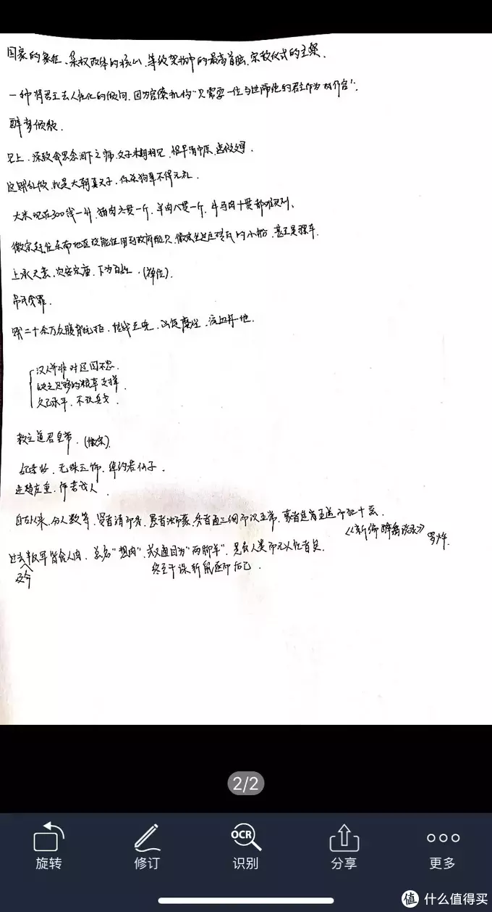](https://post.smzdm.com/p/aoo6gxo6/pic_12/)

  

  已经把不需要的边框自动裁剪，然后转化成适合电子设备阅读的PDF版本，是不是一下子感受到了科技的便利。

  对于Kindle上的标注和笔记，更是不在话下。

  

  [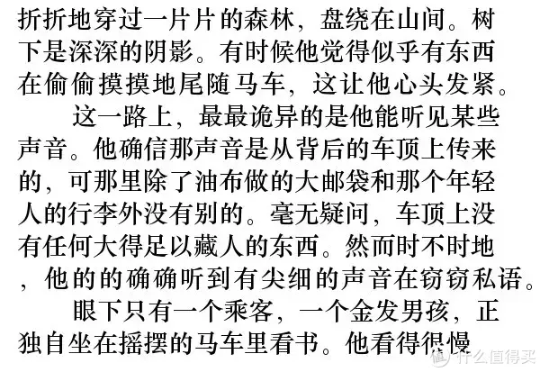](https://post.smzdm.com/p/aoo6gxo6/pic_13/)

  除了强大的扫描功能以外，OCR识别功能也是全能扫描王的一个亮点。

  通过软件处理，图片文字可以自动转换成可以直接提取的文字。

  我们在整理笔记时，利用它可以很快地将复习资料变成一个个文档随时取用，不用再对着纸质资料做低效的打字练习了。

-  Scanner pro  扫描完后利用 PDF Expert 做标记

#### 8. 办公

- **Numbers表格 + pages文稿 + keynote演讲：**

  相当于微软的Word+Excel+PowerPoint，苹果的审美品味一直是微软不得不的承认的优势，同样的办公三件套，苹果的不管在设计上还是iPad适配上都比iOS的微软三件更好用，免费提供大量的优秀模版，做表格也可以赏心悦目。目前不是非用不可的情况，一般都是用苹果的三件。

#### 9. 电子书

- **Kindle：**拥有和电子阅读器Kindle相同的图书资源，阅读体验也非常不错。但是……嗯好像一本还没看完 

#### 10. 计算

- MyScript Calculator

  可以手写需要计算的式子然后直接出结果

#### 11. 时间管理

- calendar 5

  时间规划+任务管理

- things

  任务规划

- widgetcal  锁屏可见的日历

- **番茄土豆**  保持高效学习

- Organize

- 番茄ToDo

  好几年前在旧iPad上下载过我要当学霸，这个软件清新很多～可以自定义工作时长并且可以定目标（在xx时间前完成xx个xx分钟的学习）有白噪音可选～看着统计界面自己累积的🍅和学习时间越来越长超有成就感呢～

-  Upad 

  学习和效率相结合，解决拖延问题。

  最后向大家推荐这款APP就是效率管理笔记软件Upad。

  

  能够通过设置deadline(截至日期)来督促自己完成学习任务，这一步解决的就是学习任务拖延完成的问题。

  笔记功能不用多说，Notability已经很强大了，但是Upad可以在放入笔记资料的同时，写上自己的计划心得，或者日程计划。

#### 12.截图

-  stitch 截长图，识别效率高
- 

#### 13. 画图，修图

下面这三款软件都可以修出单反的效果。

- Snapseed
- Picsplay
- Procreate 

#### 14. 分屏

- duet display
-  XDisplay 
-  Spacedesk 

#### 15. 学习

- Khan Academy（可汗学院）

  大学学习和考研奋斗中英语学习都是不可或缺的一环，如果有一款APP能够让你边听专业课，边学习英语，是不是感觉特别舒坦。

  “五维学习法”的第三维：专业课+英语的高效提升，效率杠杠的。

  可汗学院就是这么一款APP，专门用网络影片进行免费授课，涵盖内容包括：数学、历史、金融、物理、化学、生物等多学科项目。

  这个软件最大的优点就是全英文讲解还带英文字幕，毕竟精选君在学英语方面的感受就是：

  如果没有一个全英文环境去逼迫你去学习，效率真是提高不起来。

  所以，学习巩固知识的时候可以直接分屏听课，遇到不懂的就暂停下来查字典，做笔记。

  不用半年，只需要三个月，专业能力和英语水平都会有一个质的飞跃。

- 

a67